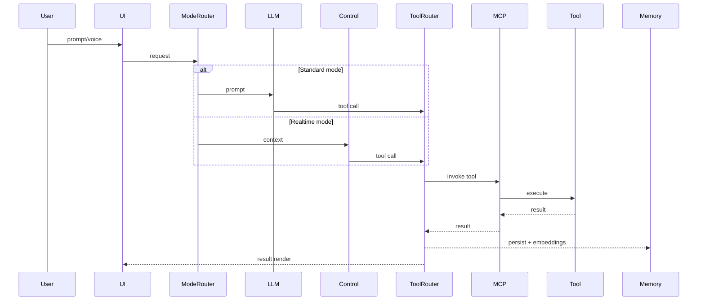
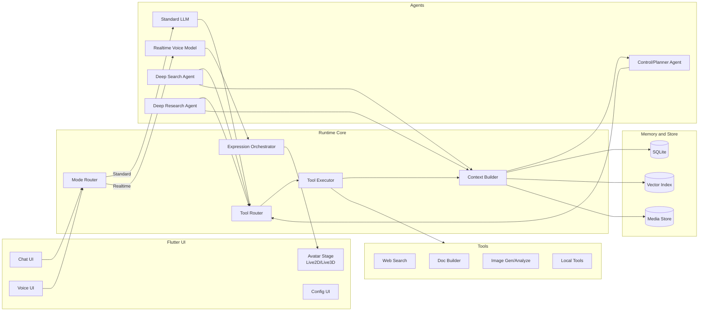
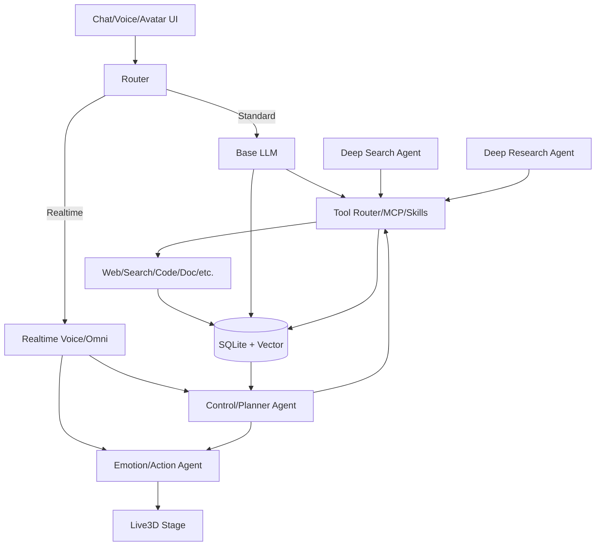
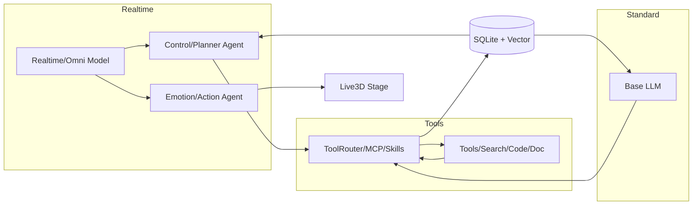

# CMYKE Architecture (Draft)

This document captures the base architecture so the UI can scale toward a
realtime, multimodal agent runtime without breaking core UX.

## Goals

- ChatGPT-style UX first: multi-session chat, message queue, exportable logs.
- Four-tier memory model that can grow into SQLite + vector DB backends.
- Clear separation between UI, domain models, and storage to support future
  Rust core + optional Python extensions.
- Dual-mode runtime: standard LLM for tool-heavy workflows and realtime
  voice models for low-latency conversation.
- Reserve avatar rendering slots (Live2D/Live3D) with shared expression events.

## Modules

- UI (Flutter)
  - Chat shell, session sidebar, message list, composer, memory panel.
  - Avatar stage container for Live2D/Live3D render surfaces.
  - Works without any backend; ready to bind to realtime gateway later.
- Domain Models
  - `ChatSession`, `ChatMessage`, `MemoryRecord`, `MemoryTier`.
- Repositories
  - `ChatRepository`: owns sessions, active session, message queue.
  - `MemoryRepository`: owns memory tiers and retrieval counts.
  - `SettingsRepository`: stores model routing + provider catalogs.
- Services
  - `LocalDatabase`: SQLite persistence in `Documents/cmyke/`.
  - `LocalStorage`: legacy JSON migration support.
  - `ChatExportService`: exports logs to `Documents/cmyke/exports/`.
  - `LlmClient`: chat + embedding calls (OpenAI-compatible + Ollama).

## Agent Roles (Draft)

- Standard LLM
  - Primary agent for tool-heavy workflows and document generation.
  - Can directly trigger tool calls when in Standard mode.
- Realtime Voice Model
  - Low-latency speech dialog; avoids heavy tool calls.
  - Emits lightweight emotion hints (optional) for avatar expression.
- Control/Planner Agent
  - Reads context + memory, decides tool calls on behalf of realtime model.
  - Outputs expression events for avatar synchronization.
- Deep Search Agent (planned)
  - Multi-source retrieval, citation tracking, structured summaries.
- Deep Research Agent (planned)
  - Task decomposition, evidence chain, report output (docs/tables).

## Runtime Routing (Draft)

Standard mode:
- User -> Standard LLM -> Tool Router -> Tool Executor -> Memory/Context.

Realtime mode:
- User -> Realtime Voice Model (dialog)
- Control/Planner Agent -> Tool Router -> Tool Executor -> Memory/Context
- Expression Orchestrator -> Avatar Stage (Live2D/Live3D)

## Memory Tiers

1) Context (in-session)
   - Short-term context window for the active chat.
2) Cross-session memory
   - Frequently used persona facts that can be injected into system prompts.
3) Autonomous memory
   - Self-saved insights from the model (text/image summaries).
4) External knowledge base
   - User-imported professional data; only fetched on-demand.

Current storage uses SQLite for local persistence with optional vector
backends (SQLite + FTS5, LanceDB, Qdrant, etc.) without UI changes.

## Model Routing (Draft)

- Standard LLM stack: LLM + Vision Agent + TTS + STT.
- Realtime stack: single realtime voice model (audio in/out, barge-in).
- Omni stack: single full-modal model (text/vision/audio).

These are configured in-app, backed by a provider catalog for each kind
(LLM, Vision Agent, Realtime, Omni, TTS, STT).

Standard LLM mode can call tools directly. Realtime mode uses a control
agent to handle tool calls and advanced workflows.

## Current Integration Notes

- Standard + Realtime routes use OpenAI-compatible `/v1/chat/completions`
  (streaming enabled).
- Embedding retrieval uses `/v1/embeddings` when configured; otherwise
  vector retrieval is disabled.
- Voice input/output is currently handled locally via STT/TTS to support
  barge-in testing. Native realtime audio WS integration is planned next.
- Provider protocols supported: OpenAI-compatible (OpenAI/SiliconFlow/DashScope/
  LM Studio) and Ollama native (`/api/chat`).

## Live3D / VRM (VRoid) Notes

- Target format: VRM 1.0 (VRoid Studio 导出). Rendering SDK plan: three-vrm (Web) / UniVRM (Unity).
- Mapping: `<|EMOTE_*|>` → Emotion/Action Agent → ExpressionEvent → VRM BlendShapeClip (configurable表情映射); LipSyncFrame (AA/EE/IH/OH/OU) → Mouth blendshapes; StageAction → Humanoid 动作/Animator trigger。
- Separation of concerns: Realtime/Omni 模型仅输出对话 + 轻量表情提示；Control/Planner 触发工具调用；Emotion/Action Agent 负责表情/动作；嘴型由音频驱动。
- Licensing: 不内置第三方模型；用户加载自有/授权 VRM，保留原许可；SDK 依赖（three-vrm/UniVRM）遵循 MIT。

## MCP and Skills (Draft)

- MCP Client
  - Tool registry, server discovery, health checks, permissions, retries.
  - Unified tool invocation path for both Standard and Realtime modes.
- Skill Registry
  - Declarative workflows that bind to MCP tools and policy rules.
  - Supports input schema, tool steps, memory writes, and output templates.
- Execution Policy
  - Standard LLM can call tools directly via Tool Router.
  - Realtime mode routes tool calls through Control/Planner Agent.
  - Deep Search/Research agents can run background tool plans.
- Result Handling
  - Tool outputs persist to Memory/Context with citations.
  - Expression events can be emitted alongside tool results.

## Logical Architecture (Draft)

## Layered Hierarchy (Standard vs Realtime)

- UI Layer: Chat/Voice/Avatar entrypoints; emits prompt/audio and receives text/audio/expression events.
- Mode Router: Splits Standard vs Realtime paths.
- Standard Path (工具友好): Base LLM 可直接 Tool Router -> MCP/Skills -> 工具；结果写入 Memory/Vector。
- Realtime Path (低延迟): Realtime Voice/Omni 模型专注对话+语音；不直接工具调用。Control/Planner Agent 读取上下文与主模型状态，触发工具/搜索；Emotion/Action Agent 生成表情/动作事件驱动 Live3D。
- Deep Search/Research Agents: 重任务管线，可被 Standard 调用，也可被 Realtime 控制代理异步唤起，再把摘要回流。
- Memory/Store: SQLite + Vector；统一为两条路径提供上下文。

Notes:
- Realtime/FunAudioLLM 不做工具调用，所有工具/搜索由 Control/Planner Agent 代理。
- Omni 模型可选直连工具，但仍建议经 ToolRouter 统一鉴权/路由。
- 表情/动作事件与嘴型驱动解耦：Emotion/Action Agent 输出表情，音频流驱动嘴型。

## Control/Tool/Expression Flows (Detailed)

- Realtime 模型专注对话/语音；不直接调用工具。
- Control/Planner 解析意图与指令，发起 ToolRouter 调用，生成表情/动作事件。
- Emotion/Action Agent 驱动 Live3D；嘴型由音频流独立驱动。
- Standard LLM 直接通过 ToolRouter 使用 MCP/Skills/工具；结果写入 Memory/Vector。
## Runtime Evolution (Planned)

- Rust Core
  - Realtime event bus (audio/text/tool events).
  - Session occupancy state machine (idle -> listening -> processing -> speaking).
- Optional Python Extensions
  - Self-hosted TTS/STT/LLM services via HTTPS.
  - MCP-compatible tool servers and adapters.

## Next Milestones

- Wire the chat UI to a realtime gateway (WS/SSE).
- Stabilize SQLite schema + vector retrieval backfill.
- Add file uploads and voice capture flows.
- Add avatar stage with Live2D/Live3D switching + expression events.
- Implement deep search + deep research workflows.
