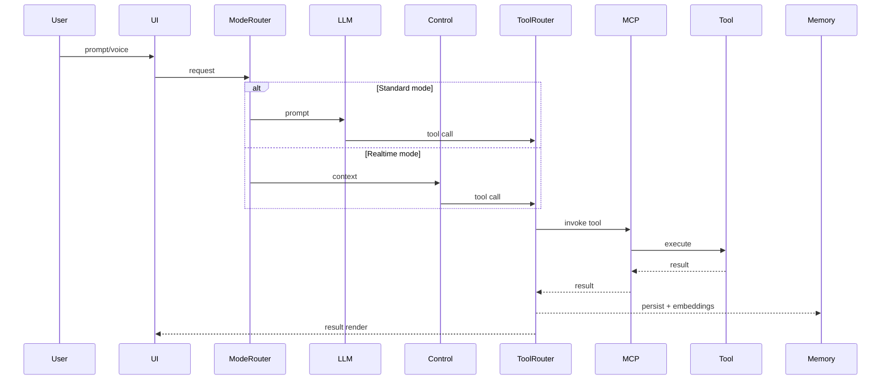
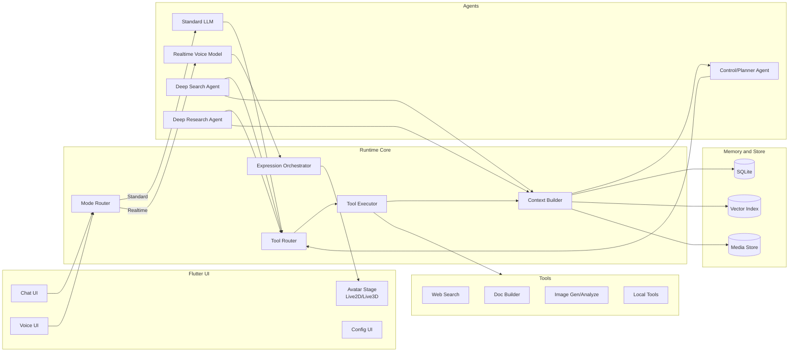
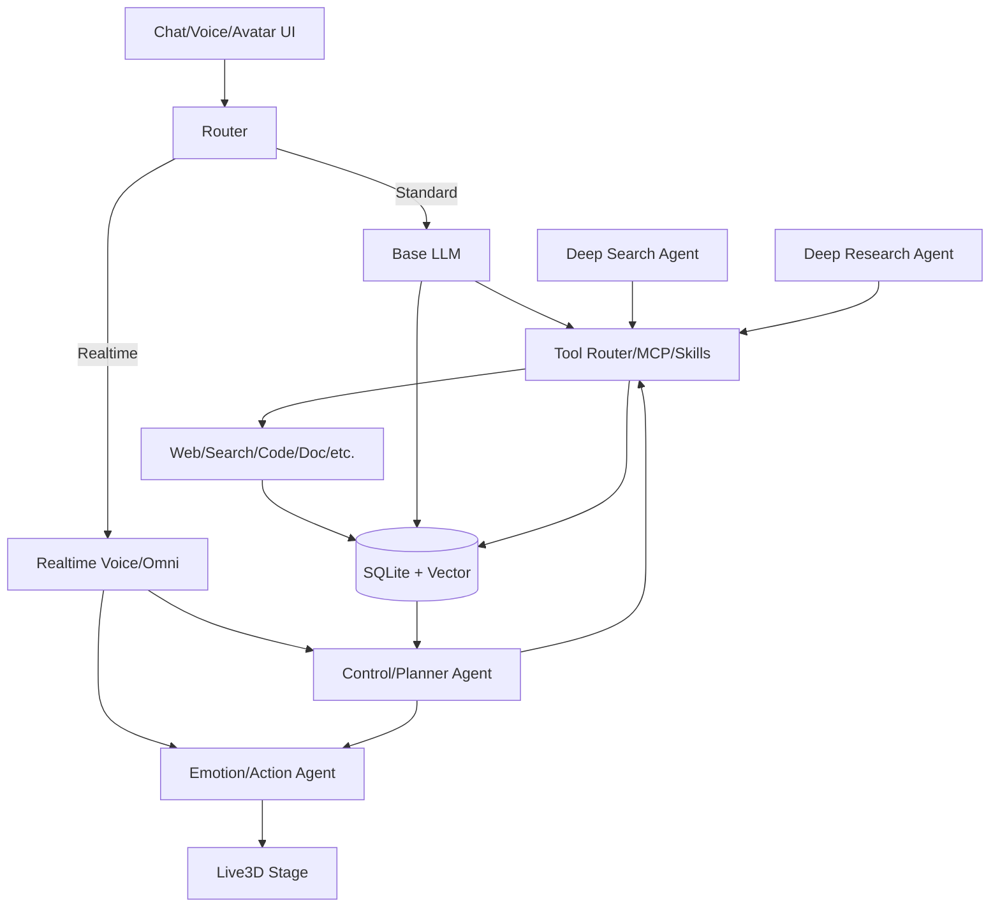
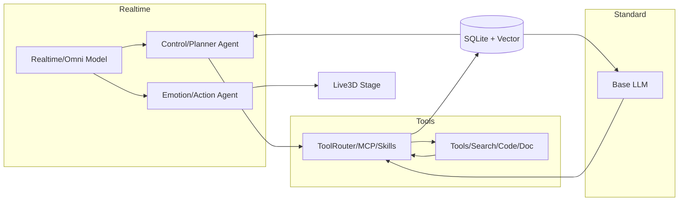

# CMYKE Architecture (Draft)

This document captures the base architecture so the UI can scale toward a
realtime, multimodal agent runtime without breaking core UX.

## Goals

- ChatGPT-style UX first: multi-session chat, message queue, exportable logs.
- Four-tier memory model that can grow into SQLite + vector DB backends.
- Clear separation between UI, domain models, and storage to support future
  Rust core + optional Python extensions.
- Dual-mode runtime: standard LLM for tool-heavy workflows and realtime
  voice models for low-latency conversation.
- JSON-first internal protocols for tool/agent/event wiring (structured outputs).
- Reserve avatar rendering slots (Live2D/Live3D) with shared expression events.

## Modules

- UI (Flutter)
  - Chat shell, session sidebar, message list, composer, memory panel.
  - Avatar stage container for Live2D/Live3D render surfaces.
  - Works without any backend; ready to bind to realtime gateway later.
- Domain Models
  - `ChatSession`, `ChatMessage`, `MemoryRecord`, `MemoryTier`.
- Repositories
  - `ChatRepository`: owns sessions, active session, message queue.
  - `MemoryRepository`: owns memory tiers and retrieval counts.
  - `SettingsRepository`: stores model routing + provider catalogs.
- Services
  - `LocalDatabase`: SQLite persistence in `Documents/cmyke/`.
  - `LocalStorage`: legacy JSON migration support.
  - `ChatExportService`: exports logs to `Documents/cmyke/exports/`.
  - `LlmClient`: chat + embedding calls (OpenAI-compatible + Ollama).

## Deployment Modes (Client Tiers)

We keep **frontend capabilities** so mobile can still work independently.

1) **Mobile Lite (Flutter only)**
   - Basic chat (LLM) + web search.
   - **Voice input/output enabled** (device STT/TTS).
   - **Deep Research available** when connected to a remote gateway.
   - No local sandbox tools, no local MCP, no computer-use.

2) **Desktop Full (Flutter + Rust Gateway)**
   - Full tools, MCP, OpenCode, Deep Research workspace.
   - Computer-use adapters (Windows UIA + OCR fallback).

3) **Gateway-only (Rust daemon)**
   - For users who want to run CMYKE in chat apps without client UI.
   - Channels: Telegram → Feishu → Computer-Use (QQ/WeChat).

## Remote Gateway Linking

- Mobile Lite can connect to a remote **Desktop Full** or **Gateway-only** host.
- Supports **LAN pairing** and **WAN pairing**:
  - **LAN pairing**: auto-discovery + local token; lowest latency.
  - **WAN pairing**: explicit URL + token; TLS required.
- Deep Research jobs execute on the gateway; mobile receives status + artifacts.

## Agent Roles (Draft)

- Standard LLM
  - Primary agent for tool-heavy workflows and document generation.
  - Can directly trigger tool calls when in Standard mode.
- Universal Agent (Standard-only)
  - Planner + executor pipeline for deep research and multi-step workflows.
  - Always uses base persona + standard LLM provider (no realtime dependency).
- Realtime Voice Model
  - Low-latency speech dialog; avoids heavy tool calls.
  - Emits lightweight emotion hints (optional) for avatar expression.
- Control/Planner Agent
  - Reads context + memory, decides tool calls on behalf of realtime model.
  - Outputs expression events for avatar synchronization.
- Embodiment Manager (planned)
  - Standard-model helper that compresses state and produces control plans for
    realtime embodiment flows (VRChat/robotics).
- VLA Spine (planned)
  - Vision-Language-Action controller that outputs short-horizon `ActionFrame`
    for external executors (guarded by policy).
- Deep Search Agent (planned)
  - Multi-source retrieval, citation tracking, structured summaries.
- Deep Research Agent (planned)
  - Task decomposition, evidence chain, report output (docs/tables).

## Runtime Routing (Draft)

Standard mode:
- User -> Standard LLM -> Tool Router -> Tool Executor -> Memory/Context.

Realtime mode:
- User -> Realtime Voice Model (dialog)
- Control/Planner Agent -> Tool Router -> Tool Executor -> Memory/Context
- Expression Orchestrator -> Avatar Stage (Live2D/Live3D)
- (Planned) Embodiment: Realtime/Omni Boss -> Manager -> VLA Spine -> Policy Gate -> Actuators

See also:
- `docs/STRUCTURED_OUTPUT_PROTOCOL.md` (JSON-first output envelopes)
- `docs/EMBODIMENT_ARCHITECTURE.md` (VRChat/robotics embodiment pipeline)

## Memory Tiers

1) Context (in-session)
   - Short-term context window for the active chat.
   - Persisted with `session_id`; deleting a session clears its context records.
2) Cross-session memory
   - Frequently used persona facts that can be injected into system prompts.
3) Autonomous memory
   - Self-saved insights from the model (text/image summaries).
4) External knowledge base
   - User-imported professional data; only fetched on-demand.

Memory records carry a lightweight `scope` tag to prevent domain mixing:
`brain.user` for persona/context memory, `knowledge.docs` for external knowledge.

Current storage uses SQLite for local persistence with optional vector
backends (SQLite + FTS5, LanceDB, Qdrant, etc.) without UI changes.

## Model Routing (Draft)

- Standard LLM stack: LLM + Vision Agent + TTS + STT.
- Realtime stack: single realtime voice model (audio in/out, barge-in).
- Omni stack: single full-modal model (text/vision/audio).

These are configured in-app, backed by a provider catalog for each kind
(LLM, Vision Agent, Realtime, Omni, TTS, STT).

Standard LLM mode can call tools directly. Realtime mode uses a control
agent to handle tool calls and advanced workflows.

## Current Integration Notes

- Standard + Realtime routes use OpenAI-compatible `/v1/chat/completions`
  (streaming enabled).
- Embedding retrieval uses `/v1/embeddings` when configured; otherwise
  vector retrieval is disabled.
- Voice input/output is currently handled locally via STT/TTS to support
  barge-in testing. Native realtime audio WS integration is planned next.
- Windows voice-channel monitoring supports in-app input-device selection
  (with system default fallback when not selected).
- Deep Research has a desktop local execution path in Flutter for current use;
  gateway/OpenCode delegated execution remains the target routing.
- Provider protocols supported: OpenAI-compatible (OpenAI/SiliconFlow/DashScope/
  LM Studio) and Ollama native (`/api/chat`).

## Live3D / VRM (VRoid) Notes

- Target format: VRM 1.0 (VRoid Studio 导出). Rendering SDK plan: three-vrm (Web) / UniVRM (Unity).
- Mapping: `<|EMOTE_*|>` → Emotion/Action Agent → ExpressionEvent → VRM BlendShapeClip (configurable表情映射); LipSyncFrame (AA/EE/IH/OH/OU) → Mouth blendshapes; StageAction → Humanoid 动作/Animator trigger。
- Separation of concerns: Realtime/Omni 模型仅输出对话 + 轻量表情提示；Control/Planner 触发工具调用；Emotion/Action Agent 负责表情/动作；嘴型由音频驱动。
- Licensing: 不内置第三方模型；用户加载自有/授权 VRM，保留原许可；SDK 依赖（three-vrm/UniVRM）遵循 MIT。

### Live3D 深化迁移（Studying/airi-main）

- 姿态驱动：移植 `pose-to-vrm` / `apply-pose-to-vrm` 思路（方向+pole、rest dir/pole、翻转抑制、平滑 slerp），JS 侧 `applyPose` 支持：
  - bones 四元数直驱。
  - targets（dir+pole）驱动。
  - worldLandmarks（mediapipe-like）自动生成 targets。
- 闲置动作：移植 `useBlink`、`useIdleEyeSaccades`、`useVRMEmote` 逻辑，让模型在基础模式下自然眨眼、注视漂移、表情过渡与呼吸微动。
- 动画：引入 `@pixiv/three-vrm-animation`，加载 `idle_loop.vrma` 作为基础 idle 动画，并通过 AnimationMixer 播放。
- LookAt：使用 `VRMLookAtQuaternionProxy` 作为 lookAt 动画支撑。

## MCP and Skills (Draft)

- MCP Client
  - Tool registry, server discovery, health checks, permissions, retries.
  - Unified tool invocation path for both Standard and Realtime modes.
- Skill Registry
  - Declarative workflows that bind to MCP tools and policy rules.
  - Supports input schema, tool steps, memory writes, and output templates.
- Execution Policy
  - Standard LLM can call tools directly via Tool Router.
  - Realtime mode routes tool calls through Control/Planner Agent.
  - Deep Search/Research agents can run background tool plans.
- Result Handling
  - Tool outputs persist to Memory/Context with citations.
  - Expression events can be emitted alongside tool results.

```mermaid
sequenceDiagram
  participant User
  participant UI
  participant ModeRouter
  participant LLM
  participant Control
  participant ToolRouter
  participant MCP
  participant Tool
  participant Memory

  User->>UI: prompt/voice
  UI->>ModeRouter: request
  alt Standard mode
    ModeRouter->>LLM: prompt
    LLM->>ToolRouter: tool call
  else Realtime mode
    ModeRouter->>Control: context
    Control->>ToolRouter: tool call
  end
  ToolRouter->>MCP: invoke tool
  MCP->>Tool: execute
  Tool-->>MCP: result
  MCP-->>ToolRouter: result
  ToolRouter-->>Memory: persist + embeddings
  ToolRouter-->>UI: result render
```

## Logical Architecture (Draft)

```mermaid
flowchart LR
  subgraph UI[Flutter UI]
    Chat[Chat UI]
    Voice[Voice UI]
    Avatar[Avatar Stage\nLive2D/Live3D]
    Settings[Config UI]
  end

  subgraph Core[Runtime Core]
    ModeRouter[Mode Router]
    ContextBuilder[Context Builder]
    ToolRouter[Tool Router]
    ToolExec[Tool Executor]
    Expression[Expression Orchestrator]
  end

  subgraph Agents[Agents]
    LLM[Standard LLM]
    RT[Realtime Voice Model]
    Control[Control/Planner Agent]
    DeepSearch[Deep Search Agent]
    DeepResearch[Deep Research Agent]
  end

  subgraph Storage[Memory and Store]
    SQL[(SQLite)]
    Vector[(Vector Index)]
    Media[(Media Store)]
  end

  subgraph Tools[Tools]
    Web[Web Search]
    Doc[Doc Builder]
    Img[Image Gen/Analyze]
    Sys[Local Tools]
  end

  Chat --> ModeRouter
  Voice --> ModeRouter

  ModeRouter -- Standard --> LLM
  LLM --> ToolRouter

  ModeRouter -- Realtime --> RT
  RT --> Expression --> Avatar
  ContextBuilder --> Control
  Control --> ToolRouter

  ToolRouter --> ToolExec --> Tools
  ToolExec --> ContextBuilder
  ContextBuilder --> SQL
  ContextBuilder --> Vector
  ContextBuilder --> Media

  DeepSearch --> ToolRouter
  DeepResearch --> ToolRouter
  DeepSearch --> ContextBuilder
  DeepResearch --> ContextBuilder
```

## Layered Hierarchy (Standard vs Realtime)

- UI Layer: Chat/Voice/Avatar entrypoints; emits prompt/audio and receives text/audio/expression events.
- Mode Router: Splits Standard vs Realtime paths.
- Standard Path (工具友好): Base LLM 可直接 Tool Router -> MCP/Skills -> 工具；结果写入 Memory/Vector。
- Realtime Path (低延迟): Realtime Voice/Omni 模型专注对话+语音；不直接工具调用。Control/Planner Agent 读取上下文与主模型状态，触发工具/搜索；Emotion/Action Agent 生成表情/动作事件驱动 Live3D。
- Deep Search/Research Agents: 重任务管线，可被 Standard 调用，也可被 Realtime 控制代理异步唤起，再把摘要回流。
- Memory/Store: SQLite + Vector；统一为两条路径提供上下文。

```mermaid
flowchart TD
  UI[Chat/Voice/Avatar UI] --> Router
  Router -- Standard --> StdLLM[Base LLM]
  StdLLM --> ToolRouter[Tool Router/MCP/Skills]
  ToolRouter --> Tools[Web/Search/Code/Doc/etc.]
  Tools --> Memory[(SQLite + Vector)]
  StdLLM --> Memory

  Router -- Realtime --> RT[Realtime Voice/Omni]
  RT --> ExprAgent[Emotion/Action Agent]
  ExprAgent --> Avatar[Live3D Stage]
  RT --> CtrlAgent[Control/Planner Agent]
  CtrlAgent --> ToolRouter
  CtrlAgent --> ExprAgent

  DeepSearch[Deep Search Agent] --> ToolRouter
  DeepResearch[Deep Research Agent] --> ToolRouter
  ToolRouter --> Memory
  Memory --> CtrlAgent
```

Notes:
- Realtime/FunAudioLLM 不做工具调用，所有工具/搜索由 Control/Planner Agent 代理。
- Omni 模型可选直连工具，但仍建议经 ToolRouter 统一鉴权/路由。
- 表情/动作事件与嘴型驱动解耦：Emotion/Action Agent 输出表情，音频流驱动嘴型。

## Control/Tool/Expression Flows (Detailed)

```mermaid
flowchart LR
  subgraph Realtime
    RT[Realtime/Omni Model]
    Ctrl[Control/Planner Agent]
    Expr[Emotion/Action Agent]
  end
  subgraph Standard
    LLM[Base LLM]
  end
  subgraph Tools
    Router[ToolRouter/MCP/Skills]
    T[Tools/Search/Code/Doc]
  end
  Memory[(SQLite + Vector)]
  Avatar[Live3D Stage]

  RT --> Ctrl
  RT --> Expr
  Expr --> Avatar
  Ctrl --> Router
  LLM --> Router
  Router --> T --> Router
  Router --> Memory
  Memory --> Ctrl
  Memory --> LLM
```

- Realtime 模型专注对话/语音；不直接调用工具。
- Control/Planner 解析意图与指令，发起 ToolRouter 调用，生成表情/动作事件。
- Emotion/Action Agent 驱动 Live3D；嘴型由音频流独立驱动。
- Standard LLM 直接通过 ToolRouter 使用 MCP/Skills/工具；结果写入 Memory/Vector。
## Runtime Evolution (Planned)

- Rust Core
  - Realtime event bus (audio/text/tool events).
  - Session occupancy state machine (idle -> listening -> processing -> speaking).
- Optional Python Extensions
  - Self-hosted TTS/STT/LLM services via HTTPS.
  - MCP-compatible tool servers and adapters.

## Next Milestones

- Wire the chat UI to a realtime gateway (WS/SSE).
- Stabilize SQLite schema + vector retrieval backfill.
- Add file uploads and voice capture flows.
- Add avatar stage with Live2D/Live3D switching + expression events.
- Implement deep search + deep research workflows.

## Live3D 高阶控制模式（规划）

目标：在基础模式（本地 WebView 渲染 + 按钮动作/表情）之外，增加高阶模式，支持外部动捕/人形机器人/第三方引擎驱动 VRM，并能向其他软件（如 VRChat）输出控制。

### 控制模式
- 基础模式（当前默认）：
  - 轻量动作/表情/闲置微动；按钮触发挥手/点头/表情。
  - 在 WebView 内的 JS 使用本地逻辑（applyMotion/applyExpression）。
- 高阶模式（规划）：
  - WebView 暴露 pplyPose(pose) JS 接口，接收外部骨架/表情/口型驱动。
  - Flutter 侧 Live3D 卡片提供模式切换：basic/advanced，并将模式下发给 WebView。

### VRM 可控通道（需枚举并诊断）
- 骨骼（Humanoid）：头/颈/脊/胸/髋/肩/肘/腕/手/腿/膝/踝；缺骨需 fallback。
- 表情（ExpressionManager）：VRM 1.0 预设小写；自定义表情需枚举。
- 口型（Viseme）：aa/ih/uu/ee/oh。
- 动作片段（可选）：VRMA/BVH/MMD 转换片段作为兜底。

### Pose → VRM 映射框架（参考 Studying/airi-main）
- 参考：Studying/airi-main/packages/model-driver-mediapipe/src/three/pose-to-vrm.ts、pply-pose-to-vrm.ts。
- 流程：
  1) 载入 VRM 后打印骨骼/表情/viseme 列表（诊断日志）。
  2) 坐标系对齐：统一右手坐标，记录休止姿态 quaternion 作为偏移基准。
  3) 每帧 pplyPose(pose)：对骨骼 one.quaternion.slerp(target, alpha) 平滑；缺骨 fallback；对肘/膝限幅防穿模。
  4) 表情/口型：用 pose 概率驱动 xpressionManager 和 viseme（VRM 1.0 小写预设）。
  5) 动作片段作为兜底（wave/nod/point 等），当外部驱动缺失时触发。

### 输入适配与输出扩展
- 输入：Flutter 侧通过 Live3DBridge 将外部算法的 pose JSON 透传到 WebView pplyPose；统一格式（关节四元数，右手坐标，含表情/口型概率）。
- 输出：预留接口将本地姿态/表情流输出到其他软件（如 VRChat），作为未来集成：
  - VRChat OSC/Avatar 控制：将 pose/表情映射到 VRChat Avatar 参数（需独立模块）。
  - 视觉接入：在高阶模式下可选接入视觉流，驱动视线/头部朝向。

### 后续实施顺序
1) WebView：加入控制模式开关、骨骼/表情诊断、pplyPose(pose) 框架（含平滑/限幅占位）。
2) Flutter：Live3D 卡片增加 basic/advanced 切换，下发模式；Live3DBridge 增加 sendPose 透传。
3) 映射表：根据诊断结果调整 rm_mapping.dart（表情/口型），并为缺骨做 fallback。
4) 输出扩展（后续）：VRChat/其他软件的桥接模块，将 pose/表情转换为目标协议（如 OSC）。

